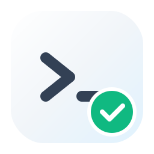
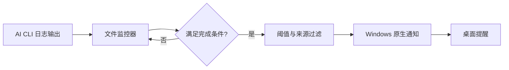
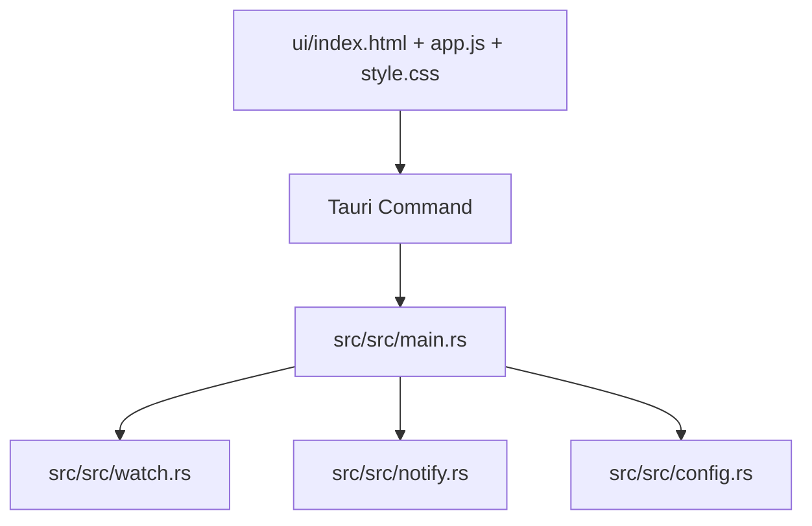

# Aitify

<p align="center">
  
</p>

<p align="center">
  <strong>让 AI CLI 任务完成通知，回到桌面该有的样子。</strong>
</p>

<p align="center">
  
  
  
  
  
</p>

Aitify 是一个专为 Windows 打造的 AI CLI 任务提醒工具。  
它会持续监听 Claude / Codex / Gemini 的本地日志文件，在检测到任务完成后触发系统通知，帮你把注意力留在真正重要的事情上。

## 功能亮点

- 多源监听：支持 Claude / Codex / Gemini 独立开关
- 阈值过滤：按“最小时长（分钟）”过滤短任务通知
- 系统托盘：关闭窗口后驻留托盘，不中断监听
- 一键测试：内置测试通知，快速验证通知链路
- 启动行为：支持开机自启、静默启动
- 轻量架构：前端原生 HTML/CSS/JS，后端 Rust + Tauri

## 工作流程图



## 技术架构



## 快速开始

### 1. 环境要求

- Windows 10 / 11
- Node.js 18+
- Rust 1.77+

### 2. 安装依赖

```bash
npm install
```

### 3. 启动开发模式

```bash
npm run dev
```

## 打包与产物

项目采用统一产物路径，最终交付文件只看 `dist/`：

- 安装包（NSIS）：`dist/installer/Aitify-setup.exe`
- 便携版（Portable）：`dist/portable/Aitify-portable.exe`

中间编译目录统一为：`target/`

```bash
# 默认构建安装包（NSIS）
npm run build

# 显式构建安装包（NSIS）
npm run build:nsis

# 构建便携版（Portable）
npm run build:portable
```

## 配置说明

应用内可配置项包括：

- AI 源开关：Claude / Codex / Gemini
- 每个 AI 源的最小通知时长（分钟）
- 语言（简体中文 / English）
- 开机自启
- 静默启动

## 项目结构

```text
Aitify/
├─ ui/                     # 前端静态页面
├─ src/                    # Tauri + Rust
│  ├─ src/
│  │  ├─ main.rs
│  │  ├─ watch.rs
│  │  ├─ notify.rs
│  │  └─ config.rs
│  └─ tauri.conf.json
├─ dist/                   # 最终交付产物
└─ target/                 # 编译中间产物
```

## 常见问题

### 1. 为什么收不到通知？

- 先点击“测试通知”确认通知权限正常
- 确认对应 AI 源已开启
- 确认任务时长超过配置阈值

### 2. `build:portable` 失败并提示文件被占用？

- 关闭正在运行的 Aitify 进程
- 关闭可能占用产物文件的终端或文件预览器
- 重新执行 `npm run build:portable`

## 贡献指南

欢迎 Issue 与 PR。建议提交流程：

1. 提交前运行本地构建与基本功能验证
2. 变更保持最小化，并附上必要说明
3. UI 变更附截图或录屏说明

## 许可证

ISC
